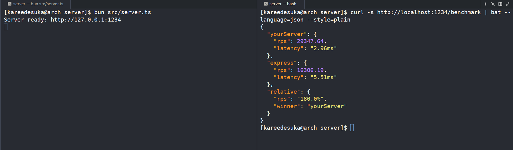
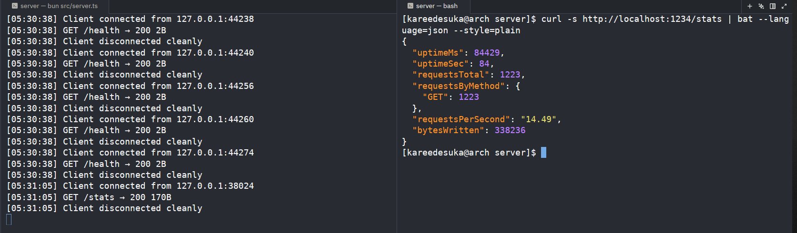

# HTTP/1.1 Server From Scratch  {TypeScript}

> Zero dependencies. Raw TCP sockets. Manual HTTP parsing. 
> Because I wanted to know what `app.get()` actually does.


## Why I Built This

I was looking to build something from scratch & not use a framework, 
not follow a tutorial blindly, but actually understand how the technology 
I use every day works under the hood.

So I chose the thing I use most and understand least: HTTP.

This server has **zero dependencies**. No Express. No `http` module. 
Just Node's `net.Socket` and Buffer management. Everything else 
request parsing, header validation, body streaming, routing — I wrote myself.


**The server loop (`serveClient`):**

1. **Buffer data** from socket into `DynBuf` until `\r\n\r\n` found
2. **Cut message** — extract complete request, parse into `HTTPReq`
3. **Create body reader** — `readerFromReq()` decides: no body, `Content-Length`, or chunked
4. **Route to handler** — match URI, return `HTTPRes`
5. **Send response** — encode headers, stream body chunks, drain request body
6. **Loop** — HTTP/1.1 keep-alive means same connection, next request

---

## Features

| Feature                       | Status      | Notes                                                       |
| ----------------------------- | ----------- | ----------------------------------------------------------- |
| HTTP/1.1 request parsing      | Done        | Manual Buffer parsing, no string conversion for URI/headers |
| Content-Length body streaming | Done        | readerFromConnLength with decrementing remain counter       |
| Connection keep-alive         | Done        | Explicit drain loop before next cutMessage                  |
| Static file serving           | Done        | MIME type detection from extension                          |
| True file streaming           | Done        | fs.createReadStream with pause/resume backpressure          |
| Request metrics               | Done        | /stats endpoint                                             |
| Health check                  | Done        | /health endpoint                                            |
| Echo endpoint                 | Done        | /echo mirrors request body                                  |
| Performance benchmark         | Done        | /benchmark vs Express using autocannon                      |


---
## Performance

Local development machine (AMD Ryzen 5, 16GB RAM, plugged in):

| Server | Requests/sec | Avg Latency |
|--------|-------------|-------------|
| **My implementation** | **29347.64** | **2.96ms** |
| Express 5.2.1 | 16,306.19 | 5.51ms |

---


---



---
Not exactly a replacement for Express, a demonstration that HTTP/1.1 is simpler than it looks, and that overhead accumulates in frameworks

## Deep Dive: True File Streaming

**The problem:** `fs.readFileSync(filepath)` loads the entire file into RAM. 
A 1GB video would crash a small VPS.

**The solution:** `readerFromFileStream` — a `BodyReader` that yields chunks 
without buffering the whole file.

```typescript
// Before: loads entire file
body: readerFromMemory(fs.readFileSync(filepath))  // 1GB = 1GB RAM

// After: streams chunks
body: readerFromFileStream(filepath)  // ~64KB at a time
```

## Quick Start

```bash
# 1. Clone the repo
git clone https://github.com/aryansaves/servee.git
cd http-server

# 2. Install Bun (if you don't have it)
curl -fsSL https://bun.sh/install | bash

# 3. Start the server
bun src/server.ts

# 4. Test it (in another terminal)
curl http://localhost:1234/
curl http://localhost:1234/stats
curl http://localhost:1234/health

# 5. Run benchmark
curl http://localhost:1234/benchmark
```
## License

MIT — see [LICENSE](./LICENSE)
